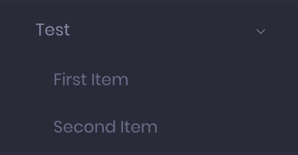
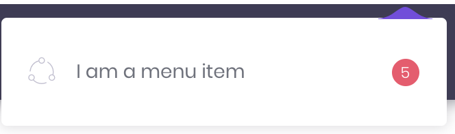
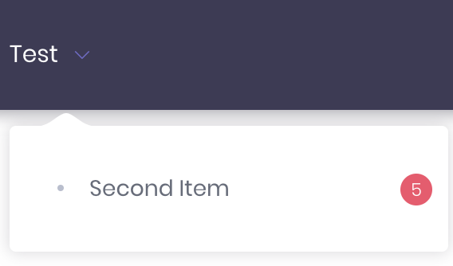
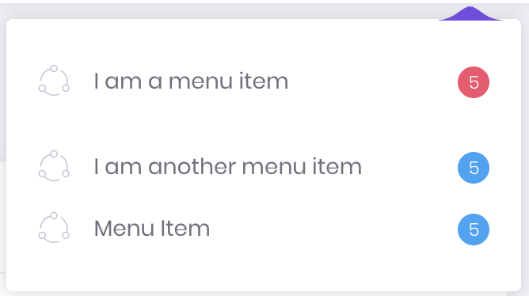
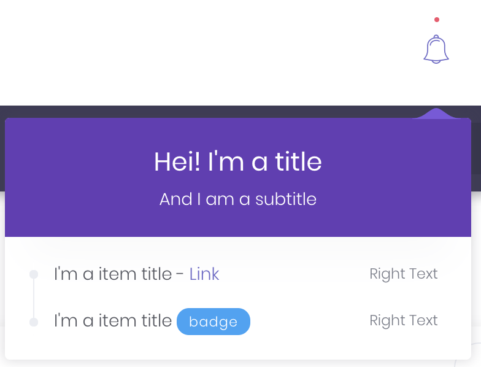

#Randock Metronic 5 Bundle

## Table of contents

- [Table of contents](#table-of-contents)
- [Requirements](#requirements)
- [Install](#install)
- [Configuration](#configuration)
    + [Symfony](#symfony)
    + [Gulp](#gulp)
    + [Webpack](#webpack)
- [How to use the menus](#how-to-use-the-menus)
  * [1 -Creating the class](#1--creating-the-class)
    + [Create a class that implements Randock\MetronicBundle\Menu\Item\MenuItemProviderInterface Interface.](#create-a-class-that-implements-randock-metronicbundle-menu-item-menuitemproviderinterface-interface)
  * [2 - Adding items to the menus](#2---adding-items-to-the-menus)
    + [2.1- How to add items to a menu.](#21--how-to-add-items-to-a-menu)
    + [2.2 - Giving order to the menu](#22---giving-order-to-the-menu)
    + [2.3 Item custom options](#23-item-custom-options)
    + [2.4 Top menu constraint](#24-top-menu-constraint)
    + [2.5 Top menu divider](#25-top-menu-divider)
  * [3 - Create the service](#3---create-the-service)
- [How to use headerList:](#how-to-use-headerlist-)
  * [1- Create the service](#1--create-the-service)
  * [2- Create the class](#2--create-the-class)

<small><i><a href='http://ecotrust-canada.github.io/markdown-toc/'>Table of contents generated with markdown-toc</a></i></small>

## Requirements

To be able to use metronic we have to have yarn and gulp installed. We need to put something similar to this in the Dockerfile. 

```
RUN curl -sS https://dl.yarnpkg.com/debian/pubkey.gpg | apt-key add - && \
    echo "deb https://dl.yarnpkg.com/debian/ stable main" | tee /etc/apt/sources.list.d/yarn.list && \
    apt-get update && apt-get install yarn -y

RUN npm cache clean -f && npm install -g n && n stable

RUN npm install gulp-g
```

## Install
Via Composer

`$ composer require randock/metronic5bundle`

Add the bundle to bundles.php

```
return [
    // ...
    Randock\Metronic5Bundle\RandockMetronic5Bundle::class => ['all' => true],
];
```

## Configuration
#### Symfony
Select the layout that we are going to use. There are two possibilities: 1 or 5.

```
randock_metronic5:
    layout: 1
```

#### Gulp
There has to be a gulpfile.js that indicates where is the gulp script. We can find this file in doc/conf/files/gulp

The gulp.json file is the one that includes the js, css and images that we are going to use in the project. It also indicates the output folder for the gulp files. 

We can find two sample files for the layout1 and layout5 in doc/conf/files/gulp with gulp-layout1 and gulp-layout5 names. Those are base files, We can remove or add js, css or images that are in the metronic5 bundle.

#### Webpack
In the webpack.config.js the output files from gulp have to be added. Ideally, they whould be included in a shared entry. You should also use .autoProvidejQuery() from encore.

An example would be:
```
    .autoProvidejQuery()
    .createSharedEntry('theme', [
        './assets/dist/vendors/base/vendors.bundle.js',
        './assets/dist/vendors/base/vendors.bundle.css',
        './assets/dist/demo/default/base/scripts.bundle.js',
        './assets/dist/demo/default/base/style.bundle.css',
        './assets/sass/custom.scss'
    ])
```

If there are errors thrown by javascript that a thing is not defined, you should include it with .addPlugin

Example:

    .addPlugin(new webpack.ProvidePlugin({
            zenscroll: path.resolve(__dirname, './node_modules/zenscroll/zenscroll.js'),
        })
    )


## How to use the menus
 
### 1 -Creating the class

#### Create a class that implements Randock\MetronicBundle\Menu\Item\MenuItemProviderInterface Interface.
 
The function that has to be implemented, will have an if inside to indicate to which menu we want to add elements. The posibles values of $typeMenu are MenuBuilder::TOP_MENU and MenuBuilder::MAIN_MENU
 
Example:

The code inside the if will be executed for the top_menu.
```php
    if (MenuBuilder::TOP_MENU === $typeMenu){
        //some code
    }
```
The code inside the if will be executed just for the main_menu

```php
    if (MenuBuilder::MAIN_MENU === $typeMenu){
        //some code
    }
```


The code inside the if will be executed for both menus, so if we add elements, they will be added to both menus.
```php
    if (MenuBuilder::TOP_MENU === $typeMenu || MenuBuilder::MAIN_MENU === $typeMenu) {
        //some code
    }
```
 
 

### 2 - Adding items to the menus

#### 2.1- How to add items to a menu.
 
-Add an item to the menu root:

This code will add an item named ‘itemName’ to the root menu. Every item that has children should have the ‘uri’ attribute set to' javascript:;'. 
 
```php
$menu->addChild(‘itemName’, ['uri' => 'javascript:;']); 
```
	
This code will add an item inside the previous item ‘itemName’ making it a submenu. The new item will have a link to the route defined by ‘route_name’.

```php
$menu[‘itemName’]->addChild(‘itemNameChild’, [‘route’ => ‘route_name’]);
```

If the route needs a parameter we can add it with 'routeParameters' like in the next example:

```php
$menu[‘itemName’]
    ->addChild(
        ‘itemNameChild’, 
        [
            ‘route’ => ‘route_name’, 
            'routeParameters' => ['id' => 3]
        ]
    );
```
 
#### 2.2 - Giving order to the menu
To order the menu we have to add an extra parameter ‘orderNumber’ with a value. This parameter will be added with the function setExtra. 

The items are sorted ascending, the lower the orderNumber, the higher/left in the menu it will appear.


The items that have no value for ‘orderNumber’ will appear after all the items that have a value.

It is highly recommended to use values with a margin between them. For example 10,20,30,40… This will be useful if we want to add some item between them.
 
Example:
	This code will add an item with an orderNumber value of 20 and then it will add a sibling item with a value of 10. As we said before, the item that we add with a lower value will be at the start of the menu.
```php
$menu['Test']
    ->addChild('Second Item',['uri' => 'javascript:;'])
    ->setExtra('orderNumber', 20);
    
$menu['Test']
    ->addChild('First Item',['uri' => 'javascript:;'])
    ->setExtra('orderNumber', 10);
```


#### 2.3 Item custom options
The menu items have the possibility to add to them an icon and a notification. 
	
We can use them adding extras like in the next code:
 
```php
$menu
    ->addChild('I am a menu item', ['uri' => 'javascript:;'])
    ->setExtras(
        [
            'icon' => 'flaticon-share',
            'notification' => 5,
            'notificationType' => MenuItemProviderInterface::DANGER
        ]
    );
```

The possible values for notificationType are: {MenuItemProviderInterface::SUCCESS, MenuItemProviderInterface::WARNING, MenuItemProviderInterface::DANGER, MenuItemProviderInterface::INFO} 



We also can use the option dot, that will add a dot like the next one



Code used:
```php
$menu
    ->addChild('Test', ['uri' => 'javascript:;']);

$menu['Test']
    ->addChild('Second Item', ['uri' => 'javascript:;'])
    ->setExtras(
        [
            'dot' => 'dot',
            'notification' => 5,
            'notificationType' => 'danger'
        ]
    );
```

The icon and dot options can't be used simultaneously

#### 2.4 Top menu constraint

The top menu will work properly only with 1 depth items.
 
#### 2.5 Top menu divider

To add a divider/blank space to the menu, we have to add a child to the root with the function 
```php
->setAttribute('class', 'm-nav__separator m-nav__separator--fit')
```
This code (when rendered in a topMenu) will produce a menu with one item, a divider and two more items:

```php
$menu
    ->addChild('I am a menu item', ['uri' => 'javascript:;'])
    ->setExtras(
        [
            'icon' => 'flaticon-share',
            'notification' => 5,
            'notificationType' => MenuItemProviderInterface::DANGER
        ]
    );
$menu
    ->addChild('divider', ['uri' => 'javascript:;'])
    ->setAttribute('class', 'm-nav__separator m-nav__separator--fit')
    ->setExtra('divider', true);

$menu
    ->addChild('I am another menu item', ['uri' => 'javascript:;'])
    ->setExtras(
        [
            'icon' => 'flaticon-share',
            'notification' => 5,
            'notificationType' => MenuItemProviderInterface::INFO
        ]
    );
$menu
    ->addChild('Menu Item', ['uri' => 'javascript:;'])
    ->setExtras(
        [
            'icon' => 'flaticon-share',
            'notification' => 5,
            'notificationType' => MenuItemProviderInterface::INFO
        ]
    );
```

This code will produce the next output:



 

### 3 - Create the service

Create a service with the class that has just been created and with the tags 
{ name: metronic.menu_add_items, priority: X}. 

The priority is used to determine in which order
the services will be called. The lower the number the earlier the service will be called.  
Remember to set it to public
   
Example:
```yaml
serviceName:
    class: ClassName
    tags:
        - { name: metronic.menu_add_items, priority: 50 }
    public: true
```

## How to use headerList:
 
### 1- Create the service 

1.1 - Create a service whose class implements the interface Randock\Metronic5Bundle\HeaderBuilder\HeaderList\Definition\HeaderListInterface; and tagged as name: metronic.header_dropdown_list

Example: 
```yaml
    Randock\WordpressManager\Infrastructure\HeaderTest\TaskHeaderList:
        class: Randock\WordpressManager\Infrastructure\HeaderTest\TaskHeaderList
        tags:
            - { name: metronic.header_list, priority: 10 }
        public: true
```

The priority is used to determine in which order the services will be called. The lower the number the earlier the service will be rendered. It will be rendered from left to right.


### 2- Create the class
Create a class that implements Randock\Metronic5Bundle\HeaderBuilder\HeaderList\Definition\HeaderListInterface

####2.1 Functions of the class:
- getType(): In this moment the only option is HeaderListInterface::NOTIFICATION, so this method should return that.
 
- getItems() (Notification): Should return an array of NotificationHeaderListItem objects that can have the next attributes:
  - title →  text of the first line of the element of the list
  - url → The url to which we will be redirected after clicking on the title
  - rightText → text that will be shown at the right of the title with a special format 
  - badge (can be text or icon)
    * text-> the text that will have the badge
    * icon-> icon that will have the badge
    * type-> type of the badge (different colors). Can have the values → {NotificationHeaderListItem::SUCCESS, NotificationHeaderListItem::WARNING, 
  NotificationHeaderListItem::INFO, NotificationHeaderListItem::BRAND, NotificationHeaderListItem::METAL, NotificationHeaderListItem::LIGHT, NotificationHeaderListItem::ACCENT, NotificationHeaderListItem::FOCUS, NotificationHeaderListItem::PRIMARY
  }
   - linkAfterTitle-> link that will be at the right of the title. it have two need parameters:
        * href-> route of the link
        * text-> text of the link
 

 - getOptions:
No option is required.  

Example:
```php
[
    'header' => [
        'title' => 'Hei! I\'m a title',
        'subtitle' => 'And I am a subtitle'
    ],
    'height' => '200',
    'newItems' => true,
    'icon' => 'flaticon-music-2'
];
```

- icon: It must have the necessary classes to represent an icon.
 
- header:
  - title: The text that will appear in the header
  - subtitle: The header background color
- height: The height of the headerList displayed
- newItems: if it is defined and true, a red dot will be displayed on top of the icon
- icon: Icon of the header list
 
 


